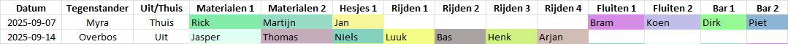

# 🏑 Team Task Scheduler

Een Python-tool om eerlijk en overzichtelijk **teamtaken** te verdelen voor sportteams, met export naar Excel.
Oorspronkelijk ontwikkeld voor **HMHC Saxenburg Heren 1**, maar bruikbaar voor ieder team dat werkt met uit- en thuiswedstrijden en vaste taken.

---

## ✨ Features

- Ondersteunt taken met scope **altijd**, **uit** of **thuis**.
- Houdt rekening met:
  - Geen dubbele taken per week.
  - Vermijden van opeenvolgende indelingen (waar mogelijk).
  - Eerlijke verdeling van **taken** én **kilometers**.
- Kleuren per speler in het schema voor snelle herkenning.
- Automatisch **statistiek-tabblad** in Excel.
- Configuratie via eenvoudige CSV-bestanden:
  - `taken.csv` → takenlijst, scope, aantal personen.
  - `wedstrijden.csv` → wedstrijdschema.
  - `spelers.csv` → namen, korte weergavenamen en taakvoorkeuren.
  - `afstanden.csv` → kilometers enkele reis naar clubs.

---

## 📂 Projectstructuur

```txt
.../Team-Task-Scheduler$
├── .gitignore
├── pyproject.toml
├── README.md
├── task_planner
│   ├── config.py
│   ├── data_loader.py
│   ├── exporter.py
│   ├── __init__.py
│   ├── __main__.py
│   ├── models.py
│   ├── scheduler.py
│   └── utils.py
├── templates
│   ├── afstanden.csv
│   ├── spelers.csv
│   ├── taken.csv
│   └── wedstrijden.csv
└── tests
```

---

## 🚀 Installatie

We gebruiken **Conda** + **pipx** + **Poetry** voor een schone, reproduceerbare omgeving.

👉 Nog geen Conda? Zie de [Conda installatiehandleiding](https://docs.conda.io/projects/conda/en/latest/user-guide/install/) of [Miniconda installatiehandleiding](https://www.anaconda.com/docs/getting-started/miniconda/).

```bash
# 1. Maak en activeer een Conda-omgeving (Python 3.13)
conda create -n team-tasks python=3.13
conda activate team-tasks

# 2. Installeer pipx en poetry
conda install conda-forge::pipx
pipx install poetry

# 3. Installeer dependencies via Poetry
poetry install
```

### Development-setup

Voor development/test worden extra tools zoals `pytest`, `black`, `ruff` en `mypy` geïnstalleerd met:

```bash
poetry install --with dev,test
```

👉 Activeer optioneel pre-commit hooks voor automatische checks:

```bash
poetry run pre-commit install
```

---

## 📊 Gebruik

1. Kopieer de map `templates/` naar een werkmap en vul deze met je eigen teamdata.
2. Draai het programma met de gewenste bestanden.
3. Open het gegenereerde **Excelbestand** (schema + statistieken).

### Templates invullen

#### `taken.csv`

| taak       | scope  | aantal |
| ---------- | ------ | ------ |
| Materialen | altijd | 2      |
| Hesjes     | altijd | 1      |
| Rijden     | uit    | 4      |
| Fluiten    | thuis  | 2      |
| Bar        | thuis  | 2      |

- **scope** = `altijd`, `uit` of `thuis`.
- **aantal** = aantal spelers dat tegelijk nodig is.

#### `spelers.csv`

| naam           | displaynaam | Materialen | Hesjes | Rijden | Fluiten | Bar |
| -------------- | ----------- | ---------- | ------ | ------ | ------- | --- |
| Jan Jansen     | Jan         | 2          | 3      | 0      | 1       | 0   |
| Piet Pietersen | Piet        | 1          | 0      | 3      | 1       | 2   |

- **displaynaam** = korte naam (uniek in schema).
- Cijfers (`0-3`) geven voorkeur aan:
  - `0 = kan niet`
  - `1 = liever niet`
  - `2 = neutraal`
  - `3 = doet graag`

#### `wedstrijden.csv`

| jaar | maand | dag | club    | team    | isUit |
| ---- | ----- | --- | ------- | ------- | ----- |
| 2025 | 09    | 07  | Myra    | Heren 1 | nee   |
| 2025 | 09    | 14  | Overbos | Heren 1 | ja    |

- **isUit** = `ja` of `nee`.

#### `afstanden.csv`

| club      | afstand_km |
| --------- | ---------- |
| Nieuwkoop | 45         |
| Soest     | 80         |

- Afstand is **enkele reis**.

---

### Schema genereren

```bash
poetry run task_planner \
  --taken templates/taken.csv \
  --wedstrijden templates/wedstrijden.csv \
  --spelers templates/spelers.csv \
  --afstanden templates/afstanden.csv \
  --uitvoer schema.xlsx
```

Output = Excelbestand met:

- **Schema**-tabblad → alle wedstrijden en toegewezen taken.
- **Statistiek**-tabblad → tellingen per speler en kilometerverdeling.

📌 Gebruik `poetry run task_planner --help` voor alle opties.

---

### Voorbeeld uitvoer

Schema-tabblad (Markdown voorbeeld):

| Datum      | Tegenstander | Uit/Thuis | Materialen 1 | Materialen 2 | Hesjes 1 | Rijden 1 | Rijden 2 | Rijden 3 | Rijden 4 | Fluiten 1 | Fluiten 2 | Bar 1 | Bar 2 |
| ---------- | ------------ | --------- | ------------ | ------------ | -------- | -------- | -------- | -------- | -------- | --------- | --------- | ----- | ----- |
| 2025-09-07 | Myra         | Thuis     | Rick         | Martijn      | Jan      |          |          |          |          | Bram      | Koen      | Dirk  | Piet  |
| 2025-09-14 | Overbos      | Uit       | Jasper       | Thomas       | Niels    | Luuk     | Bas      | Henk     | Arjan    |           |           |       |       |

Schema-tabblad (Excel voorbeeld):



---

## 🛠 Development

Format, lint en type-checks uitvoeren:

```bash
poetry run black .
poetry run ruff check .
poetry run mypy .
```

👉 Met `pre-commit` worden deze checks automatisch bij elke commit uitgevoerd.
Daarnaast controleert `commitizen` of commitboodschappen voldoen aan [Conventional Commits](https://www.conventionalcommits.org/).

### Tests

Alle unittests en integratietests draaien:

```bash
poetry run pytest -v
```

Coverage wordt automatisch gegenereerd:

- Samenvatting in de terminal
- HTML-rapport in `htmlcov/index.html`

---

## 📜 Licentie

Dit project valt onder de MIT-licentie. Zie [LICENSE](LICENSE) voor details.

---

## 🤝 Contributie

Bijdragen zijn welkom!
Houd je aan de [Conventional Commits](https://www.conventionalcommits.org/) conventie (via `cz commit`) en gebruik `pre-commit` hooks voor consistente code.

---

## 📌 Roadmap

- [ ] Afstanden automatisch ophalen vai API.
- [ ] Extra exportformaten (bijv. PDF naast Excel).
